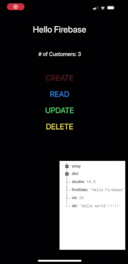

# fastcampus-ios-practice
fastCampus, iOS 앱 개발 올인원 패키지 Online 강의 공부

## ShadowAppleMusic App

- AVFoundation 활용 Player 구현
- CollectionView, CollectionViewHeader 사용
- Background Image Blur 효과

## BountyList App

- UIView Animation 사용
- CollectionView 사용
- MVVM 
- TableView 사용

## BountyList App

- Firebase Analysis 연동
- Firebase Realtime Database CRUD 구현
